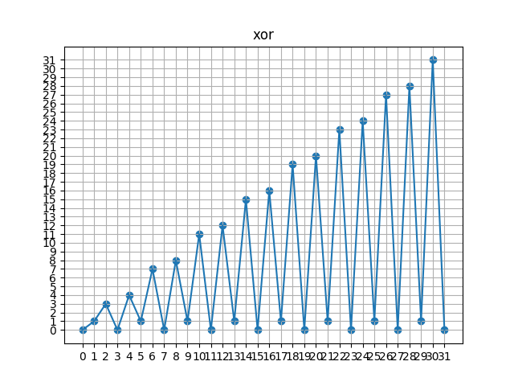

# 問題
* [ ] A
* [ ] B
* [ ] C
* [ ] D

# 要約
### A White Cells
```text
長方形の白く塗られたマスが与えられる。
各指定された数の複数行と複数列を黒色で塗りつぶす時、白のままのマスの数を求める。
```

### B Can you solve this?
```text
点数に傾斜を掛けたものの総和に定数を加えた値が正の数になるもの個数を求める。
```

### C Energy Drink Collector
```text
あるお店ではA円でB本まで栄養ドリンクを買うことができる。
このとき、M本の栄養ドリンクを手に入れるために必要なお金の最小値を求める。
```

### D XOR World
```text
ある値からある値までの数字を全てxorした値を求める。
```

# 考察
### A White Cells
- 簡単やった。問題文通りに実装するのみ。

### B Can you solve this?
- 簡単やった。問題文通りに実装するのみ。
- numpyを使うとzipを使って展開せずに、容易に行列の計算をすることができるが、速度が大変遅くなる。

- `numpy`を使った解法
```python
import numpy as np

N, M, C = map(int, input().split())
B = np.array([int(i) for i in input().split()])
inputs = [
    sum(np.array([int(i) for i in input().split()]) * B) + C for _ in range(N)
]

print(sum([1 if inputs[i] > 0 else 0 for i in range(N)]))

```

### C Energy Drink Collector
- 簡単やった。先頭の値でソートして、貪欲に計算するのみ。
- sort部分がボトルネックとなって計算量は`O(NlogN)`.

### D XOR World
- 難しかった。xorの掛け算の性質に気づけはしたが、matplotlibで可視化して考察っすべきたった。次回以降に活かしていきたい。
- もう一つの考え方としては、連続する２数のxorは1となる性質を利用する。

# 参考
- 1から順にxorを掛けていくと、結果の値の挙動をグラフ化するスクリプト



```python
from matplotlib import pyplot
import numpy as np
from itertools import accumulate
from operator import xor

x = np.arange(0, 32, 1)
y = list(accumulate(list(np.arange(0, 32, 1)), xor))

fig = pyplot.figure()
ax = fig.add_subplot(1,1,1)

# 点をプロット
ax.scatter(x,y)
ax.set_title('xor')
# 方眼紙的に描画する
ax.grid(True)

# x軸とy軸の幅の間隔を1になるように調整
pyplot.xticks(np.arange(0, 32, 1))
pyplot.yticks(np.arange(0, 32, 1))

pyplot.plot(x, y)
pyplot.show()

```