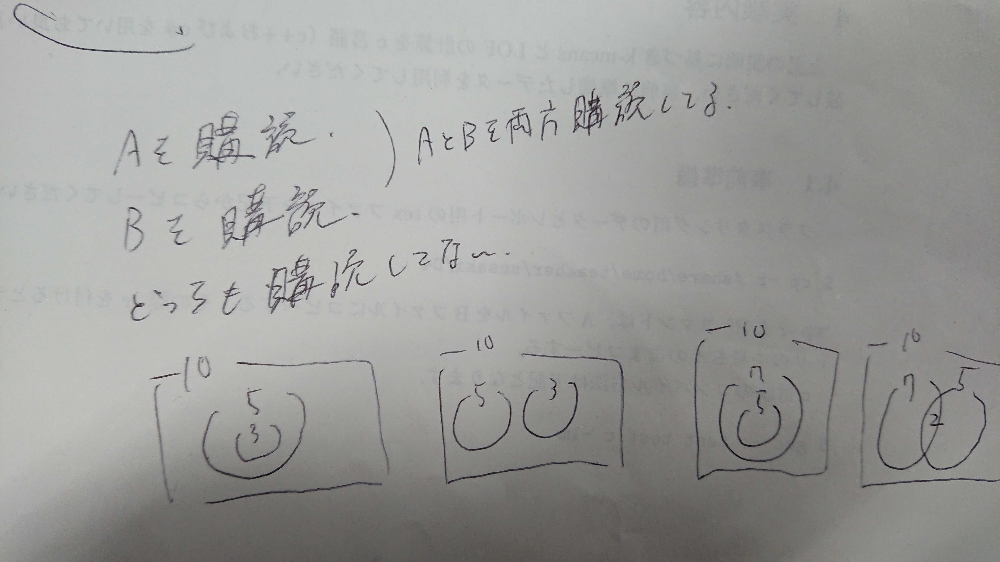

# 問題
* [x] A
* [x] B
* [x] C
* [ ] D
* [ ] E
* [ ] F

# 要約
### A Subscribers
```text
センター試験の数1Aの集合の問題。
新聞Xと新聞Yを購読してる人数が与えられる。
その中でXとYの両方を購読している人数の最大値と最小値を計算する。
```

### B Touitsu
```text
与えられた３つの文字列を全て同じにするように３つの文字列を前から順に変更。
書く文字列を変更する回数を計算する。
```

### C 
```text
料理が N 皿与えられる。その料理を食べると高橋くんは料理の１つ目の値、青木くんは２つ目の値の分だけ幸せになる。
高橋くん、青木くんの順に料理を食べていく際に、「最終的に自分が得る幸福度の総和」から「最終的に相手が得る幸福度の総和」を引いた値を最大化するように料理を選びます。
この時、「最終的に高橋くんが得る幸福度の総和」から「最終的に青木さんが得る幸福度の総和」を引いた値を求める。
```

# 考察
### A Subscribers
- A問題やのにめっちゃ時間かかってしまった。解けたからまだ耐えたけど。
- ベン図を書いて解けば焦ることなく解けたと痛感した。基本に忠実に解こう。



### B Touitsu
- 一番簡単やった。パット解法を思いつく(答えは setした長さ - 1 の総和)当たり前に進んでる気がする。

### C Different Strokes
- C問題かつ400点やし、難しそうの先入観でじっくり取り組んでみたら、あっさり解けてしまった。

- 注目すべき点は１つで、各人は「最終的に自分が得る幸福度の総和」から「最終的に相手が得る幸福度の総和」を引いた値を最大化するように料理を選ぶ。これを別の表現で言い換えると、(自分が得る幸福度) + (相手が失う幸福度) が最大になるような順番から料理を嗜んで行けば良いことに気づける。これはすなはち幸福度の和をソートして大きいものから食べていけば良い。

- 解説がめっちゃ分かりやすかった。(https://img.atcoder.jp/nikkei2019-qual/editorial.pdf)

# 結果
- このコンテストをキッカケに緑色になれたンゴ。わーいわーい。
